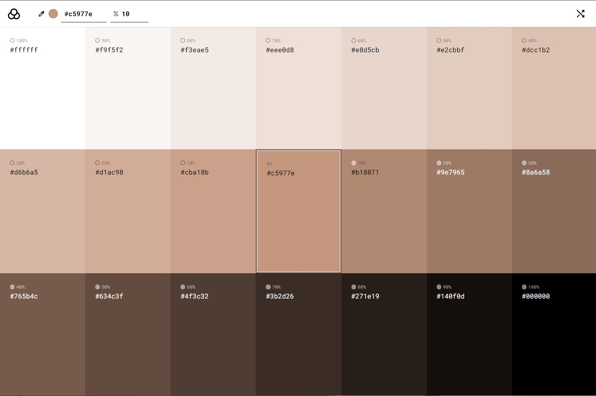

# Color Generator 🎨



## Overview

**Color Generator** is a sleek and modern web application built with React and `valus.js`. This tool allows users to explore various shades and tints of any given color. Whether you're a designer, developer, or just someone who loves colors, this tool will help you find the perfect hue for your project.

## Features

- **Color Variations**: Automatically generate a wide range of shades and tints for any input color.
- **Random Color Generator**: Easily explore new colors by clicking the randomize icon.
- **Multiple Color Formats**: Support for hex, RGB, rgba, and hsl formats.
- **Copy to Clipboard**: Quickly copy color codes for use in your projects.
- **Weight Control**: Adjust the color weight.
- **Responsive Design**: Works seamlessly across devices.

## Getting Started

Follow these steps to get the project up and running on your local machine.

### Installation

1. **Clone the repository:**

    ```bash
    git clone https://github.com/salahghr4/color-generator.git

    cd color-generator
    ```

2. **Install dependencies:**

    ```bash
    npm install
    ```

3. **Run the development server:**

    ```bash
    npm run dev
    ```

## Technology Stack

- **React**: A JavaScript library for building user interfaces.
- **Vite**: A fast build tool and development server for modern web projects.
- **valus.js**: A utility library for generating shades and tints of colors.
- **CSS**: For styling the application.
- **JavaScript**: Adding interactivity and functionality.

## Contributing

Contributions, issues, and feature requests are welcome!

## Acknowledgments

- Inspired by various color palette tools and generators.
- Thanks to the open-source community for their invaluable resources.
